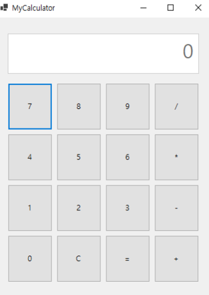

# C\# 프로그래밍

## Ch01. Hello World
## Ch02. 변수와 자료형 그리고 연산자
	- 1.변수
	- 2.자료형
	- 3.연산자
	- 4.기본입력
	- 5.자료형 변환
	- 6.문자열

## Ch03. 조건문과 배열
	- 1.If
	- 2.Switch
	- 3.For
	- 4.While
	- 5.Array
	
## Ch04. 메서드
	- 1.메서드
	- 2.메서드 타입
	- 3.메서드 오버로드
	- 4.메서드 스텍
	- 5.메서드의 매개변수
	
## Ch05. 클레스
	- 1.클레스와 객체생성
	- 2.캡슐화
	- 3.클래스의 변수와 싱글톤 객체
	- 4.클래스 상속
	- 5.클래스 오버라이드
	- 6.다형성
	
## Ch06. 클래스의 종류와 인터페이스
	- 1.추상 클래스
	- 2.인터페이스
	- 3.구조체
	- 4.제네릭
	- 5.인덱서
	- 6.자주사용하는 내장클래스
	
## Ch07. 컬렉션
	-1.스텍
	-2.큐
	-3.ArrayList
	-4.HashTable
	-5.HashSet
	
## Ch08. 예외처리
	-1.Try
	-2.Throw
	-3.FileIO
	
## Ch09. 델리게이트,람다 그리고 Linq
	-1.델리게이트
	-2.람다
	-3.Linq
## Ch10. DB커넥션
	-1.DBconnection
	-2.insert
	-3.select

***
	
## Project1. 계산기

